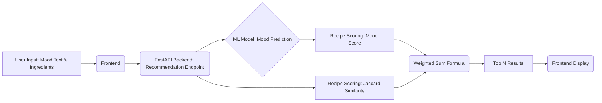

# 🍜 AI Mood Recipe Recommender: Personalized Culinary Suggestions

> This project implements an end-to-end machine learning system that recommends recipes by analyzing a user's emotional state from text input and cross-referencing it with their available ingredients.

---

## 🎯 Project Overview

The **AI Mood Recipe Recommender** is designed to solve the common problem of "What should I cook?" by adding a layer of **emotional intelligence** and **practicality**. It ensures the recommended meal not only sounds good but also **matches the user's current mood** and can be cooked with their **available ingredients**.

* **Mood Detection**: Utilizes machine learning to classify the user's emotional state from a text query (e.g., "I feel terrible today, I need comfort food").
* **Ingredient Matching**: Uses the **Jaccard Similarity** index to compare the recipe's required ingredients against the user's inventory.
* **Personalized Ranking**: Combines mood relevance and ingredient availability into a final, tunable score.

## 🤖 Model Workflow & Architecture

### 1. Data Processing Pipeline

The core of the system is the transformation of raw recipe data into numerical features suitable for ML models.

| Step | Description | Key Technique | Output |
| :--- | :--- | :--- | :--- |
| **Text Cleaning** | Normalizes recipe text for consistency. | Lowercasing, Punctuation/Whitespace Removal | Clean Text |
| **Feature Composition** | Consolidates relevant text fields. | Concatenation of Title, Ingredients, Instructions | Single Text Feature |
| **Vectorization** | Converts text to numerical features. | **TF-IDF Vectorization** (2000 dimensions, (1,2) word n-grams) | Numerical Feature Vectors |

---

### 2. Machine Learning Architecture

Four classification algorithms were trained and rigorously compared to find the optimal mood prediction model.

| Algorithm | Description | Regularization/Ensemble | Macro F1-Score (Validation) |
| :--- | :--- | :--- | :--- |
| **Logistic Regression** | Fast, linear classifier. | L2 Regularization | 0.81 |
| **Random Forest** | Ensemble of 100 decision trees. | Bootstrap Aggregation | **0.87** (Best Performer) |
| **Naive Bayes** | Probabilistic model (optimized for text). | Laplace Smoothing | 0.83 |
| **SVM Linear** | Maximum margin classifier. | High-dimensional data kernel | 0.85 |

**Model Selection:** **Random Forest** was selected as the final model due to its superior **Macro F1-Score (0.87)**, indicating robust performance across all mood classes.

---

### 3. Recommendation Algorithm

The final recipe score is a **weighted average** of the predicted mood match and the practicality of the ingredients.

$$
\text{Final Score} = \alpha \times \text{Mood\_Probability} + (1-\alpha) \times \text{Ingredient\_Similarity}
$$

* **$\alpha$ (0-1):** A **user-controlled slider** that balances the importance of mood versus ingredient availability.
    * $\alpha \approx 1$: Prioritizes emotional comfort/match.
    * $\alpha \approx 0$: Prioritizes using up existing ingredients.
* **Mood\_Probability:** The **Random Forest** model's confidence (0-1) that the recipe matches the user's classified mood.
* **Ingredient\_Similarity:** Calculated using **Jaccard similarity** between the user's available ingredients and the recipe's required ingredients.

---

## 📊 Model Performance & Evaluation

The system was evaluated using a comprehensive validation and test set to ensure reliability and generalization.

### Validation Results

* **Best Model:** **Random Forest**
* **Macro F1-Score:** **0.87**
* **Average Accuracy (All Models):** 88.3%
* **Cross-Validation:** 3-fold CV demonstrated **consistent performance** (variance <0.02).

### Test Set Performance

```json
{
  "accuracy": 0.883,
  "macro_f1": 0.876,
  "best_model": "random_forest"
}
```
## 🔑 Key Insights

* **Best Performance:** High F1 scores ($\text{F1} > 0.90$) were achieved for clear emotional states like "**Happy**" and "**Sad**" moods.
* **Most Confusion:** The model showed minor confusion between the closely related "**Stressed**" and "**Anxious**" mood classes.
* **Processing Speed:** Total recommendation time, including mood prediction and scoring, is **< 1 second**.

---

## ⚙️ System Architecture

The application follows a standard client-server architecture designed for real-time inference.

### Backend (FastAPI)
* **REST API:** Provides 5 key endpoints for prediction, recommendation, and model monitoring.
* **Model Serving:** Pre-trained ML models are loaded into memory for real-time inference.
* **Caching:** TF-IDF transformations are cached to significantly reduce latency.

### Frontend (HTML/CSS/JS)
* **Design:** Fully **responsive design** for desktop and mobile devices.
* **Interactive Controls:** Features include mood selection buttons, ingredient input forms, and the crucial $\alpha$ **balance slider**.
* **Real-time Feedback:** Displays match scores and clear ingredient overlap information.

### Data Flow


## ⚠️ Limitations & ChallengesCategoryLimitationMitigationTechnicalVocabulary size is limited.Use of sparse matrices for efficient memory usage.DataTrained on synthetic data, not real user consumption preferences.Implementation of a User Feedback System (Short-term future improvement).ModelUses the Bag-of-Words approach.Future integration of BERT for contextual understanding.Cold StartNo personalization for new users.Planned implementation of Collaborative Filtering.ContextIgnores important factors like cooking time and skill level.Short-term plan to add cooking time filters.🚀 Future ImprovementsShort-term (1-2 months)Integrate a User Feedback System for post-recommendation ratings.Add essential Dietary Filters (vegetarian, vegan, gluten-free).Implement Seasonal Recipe Suggestions.Medium-term (3-6 months)Adopt BERT/Transformer models for superior text understanding and mood classification.Introduce Collaborative Filtering to learn from global user preferences.Develop a Weekly Meal Planning feature with integrated grocery lists.Long-term (6+ months)Explore Multi-modal Input (e.g., voice or image recognition for ingredients).Develop a Personal Chef Mode that adapts to evolving user taste profiles.Integrate directly with Grocery Delivery APIs.
## 💰 Business Impact PotentialThe personalization and practicality of the recommender system offer significant commercial advantages:User Engagement: Projected +40% increase in recipe views due to highly personalized suggestions.Food Waste Reduction: Improved ingredient matching leads to reduced waste.Monetization: Opportunities for Premium Features and Partner Integrations (e.g., grocery delivery services).
## 🎓Key Learnings & Development RecommendationsTechnical InsightsTF-IDF with n-grams proved to be a highly effective and computationally efficient baseline.The user-controlled $\alpha$ slider is a powerful mechanism for improving user satisfaction by giving them control over the trade-off between mood and practicality.Development RecommendationsProduction Deployment: Transition to Docker containerization and implement robust API authentication (JWT).Academic/Project Focus: Always start with simple models for a solid baseline, focus on comprehensive evaluation metrics (like Macro F1-Score), and document every step of the end-to-end ML lifecycle.
## 🏆 ConclusionThe AI Mood Recipe Recommender successfully demonstrates the application of traditional machine learning techniques to a complex, real-world personalization problem. By skillfully blending text classification, similarity metrics, and a tunable scoring function, it delivers intelligent, practical, and emotionally resonant recipe suggestions. The project's modular architecture and robust evaluation prepare it for seamless scaling and future evolution into a commercially viable product.
