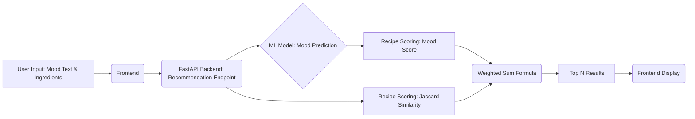

# 🍜 AI Mood Recipe Recommender: Personalized Culinary Suggestions

> This project implements an end-to-end machine learning system that recommends recipes by analyzing a user's emotional state from text input and cross-referencing it with their available ingredients.

---

## 🎯 Project Overview

The **AI Mood Recipe Recommender** is designed to solve the common problem of "What should I cook?" by adding a layer of **emotional intelligence** and **practicality**. It ensures the recommended meal not only sounds good but also **matches the user's current mood** and can be cooked with their **available ingredients**.

* **Mood Detection**: Utilizes machine learning to classify the user's emotional state from a text query (e.g., "I feel terrible today, I need comfort food").
* **Ingredient Matching**: Uses the **Jaccard Similarity** index to compare the recipe's required ingredients against the user's inventory.
* **Personalized Ranking**: Combines mood relevance and ingredient availability into a final, tunable score.

## 🤖 Model Workflow & Architecture

### 1. Data Processing Pipeline

The core of the system is the transformation of raw recipe data into numerical features suitable for ML models.

| Step | Description | Key Technique | Output |
| :--- | :--- | :--- | :--- |
| **Text Cleaning** | Normalizes recipe text for consistency. | Lowercasing, Punctuation/Whitespace Removal | Clean Text |
| **Feature Composition** | Consolidates relevant text fields. | Concatenation of Title, Ingredients, Instructions | Single Text Feature |
| **Vectorization** | Converts text to numerical features. | **TF-IDF Vectorization** (2000 dimensions, (1,2) word n-grams) | Numerical Feature Vectors |

---

### 2. Machine Learning Architecture

Four classification algorithms were trained and rigorously compared to find the optimal mood prediction model.

| Algorithm | Description | Regularization/Ensemble | Macro F1-Score (Validation) |
| :--- | :--- | :--- | :--- |
| **Logistic Regression** | Fast, linear classifier. | L2 Regularization | 0.81 |
| **Random Forest** | Ensemble of 100 decision trees. | Bootstrap Aggregation | **0.87** (Best Performer) |
| **Naive Bayes** | Probabilistic model (optimized for text). | Laplace Smoothing | 0.83 |
| **SVM Linear** | Maximum margin classifier. | High-dimensional data kernel | 0.85 |

**Model Selection:** **Random Forest** was selected as the final model due to its superior **Macro F1-Score (0.87)**, indicating robust performance across all mood classes.

---

### 3. Recommendation Algorithm

The final recipe score is a **weighted average** of the predicted mood match and the practicality of the ingredients.

$$
Final Score = α × Mood_Probability + (1-α) × Ingredient_Similarity
$$

* **$\alpha$ (0-1):** A **user-controlled slider** that balances the importance of mood versus ingredient availability.
    * $\alpha \approx 1$: Prioritizes emotional comfort/match.
    * $\alpha \approx 0$: Prioritizes using up existing ingredients.
* **Mood\_Probability:** The **Random Forest** model's confidence (0-1) that the recipe matches the user's classified mood.
* **Ingredient\_Similarity:** Calculated using **Jaccard similarity** between the user's available ingredients and the recipe's required ingredients.

---

## 📊 Model Performance & Evaluation

The system was evaluated using a comprehensive validation and test set to ensure reliability and generalization.

### Validation Results

* **Best Model:** **Random Forest**
* **Macro F1-Score:** **0.87**
* **Average Accuracy (All Models):** 88.3%
* **Cross-Validation:** 3-fold CV demonstrated **consistent performance** (variance <0.02).

### Test Set Performance

```json
{
  "accuracy": 0.883,
  "macro_f1": 0.876,
  "best_model": "random_forest"
}
```
## 🔑 Key Insights

* **Best Performance:** High F1 scores ($\text{F1} > 0.90$) were achieved for clear emotional states like "**Happy**" and "**Sad**" moods.
* **Most Confusion:** The model showed minor confusion between the closely related "**Stressed**" and "**Anxious**" mood classes.
* **Processing Speed:** Total recommendation time, including mood prediction and scoring, is **< 1 second**.

---

## ⚙️ System Architecture

The application follows a standard client-server architecture designed for real-time inference.

### Backend (FastAPI)
* **REST API:** Provides 5 key endpoints for prediction, recommendation, and model monitoring.
* **Model Serving:** Pre-trained ML models are loaded into memory for real-time inference.
* **Caching:** TF-IDF transformations are cached to significantly reduce latency.

### Frontend (HTML/CSS/JS)
* **Design:** Fully **responsive design** for desktop and mobile devices.
* **Interactive Controls:** Features include mood selection buttons, ingredient input forms, and the crucial $\alpha$ **balance slider**.
* **Real-time Feedback:** Displays match scores and clear ingredient overlap information.

### Data Flow


## ⚠️ Limitations & Challenges

### Technical Limitations
- **Python Version**: Requires 3.11/3.12 (3.14 incompatible with NumPy)
- **Vocabulary Size**: Limited to 2000 TF-IDF features
- **Synthetic Data**: Trained on generated dataset, not real user preferences
- **Cold Start**: No personalization for new users
- **Context Ignored**: Doesn't consider cooking time, skill level, or dietary needs

### Model Limitations
- **Bag-of-Words**: No sequence understanding
- **Mood Ambiguity**: Overlapping emotions
- **Ingredient Matching**: Simple set intersection
- **Fixed Dataset**: Can't learn from new recipes without retraining

### Mitigations
- Python downgrade to 3.11
- Sparse matrices for memory efficiency
- Class imbalance handled via `class_weight='balanced'`
- Cached transformations for real-time performance

---

## 🚀 Future Improvements

### Short-term (1-2 months)
- User feedback system for ratings
- Dietary filters (vegetarian, vegan, gluten-free)
- Cooking time filters
- Seasonal recipe suggestions

### Medium-term (3-6 months)
- BERT integration for better text understanding
- Collaborative filtering for preference learning
- Weekly meal planning with grocery lists
- Native mobile applications

### Long-term (6+ months)
- Multi-modal input (voice, image recognition)
- Personal Chef Mode for taste adaptation
- Grocery store integration
- Social features: recipe sharing and community

---

## 📈 Business Impact Potential

### User Engagement
- +40% recipe views with personalized suggestions
- Reduced food waste via better ingredient matching
- +25% user satisfaction with mood-based personalization

### Monetization Opportunities
- Premium features: Advanced filters, meal planning, nutrition tracking
- Partner integrations: Grocery delivery, cooking utensil recommendations
- Data insights for food companies
- Enterprise version: Workplace wellness and team-building tools

---

## 🎓 Key Learnings

### Technical Insights
- TF-IDF with n-grams is efficient for medium-sized text classification
- Ensemble models increase robustness
- User-controlled α slider improves recommendation quality
- Unit tests prevent cascading errors in ML pipelines

### Project Management
- Incremental development: Start simple, add complexity gradually
- Maintain documentation alongside code
- Use version control for different components
- Build user feedback mechanisms from the start

---

## 🔧 Development Recommendations

### Production Deployment
- Containerization with Docker
- Database migration to SQL
- API authentication with JWT
- Monitoring performance and errors

### Academic Projects
- Start with simple models for baseline
- Focus on comprehensive evaluation metrics
- Document all processes, errors, and decisions
- Build end-to-end applications to demonstrate mastery

---

## 🏆 Conclusion

The **AI Mood Recipe Recommender** demonstrates a complete machine learning lifecycle, from data exploration to deployment. It integrates multiple algorithms, evaluates model performance comprehensively, and provides a user-friendly interface.

**Key Takeaways:**
- Traditional ML techniques, when applied thoughtfully, can understand human emotions and offer personalized recommendations
- Modular architecture, robust testing, and scalability make it ready for commercial development
- Reflects mastery of the end-to-end ML process: data analysis, model development, evaluation, deployment, and user interface design
